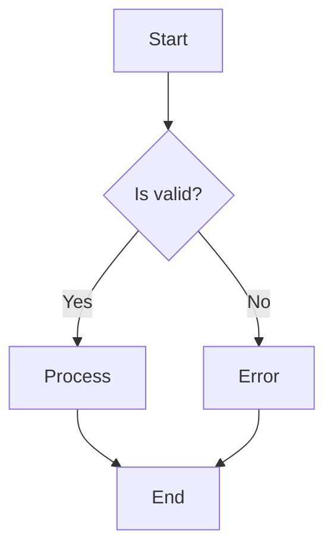
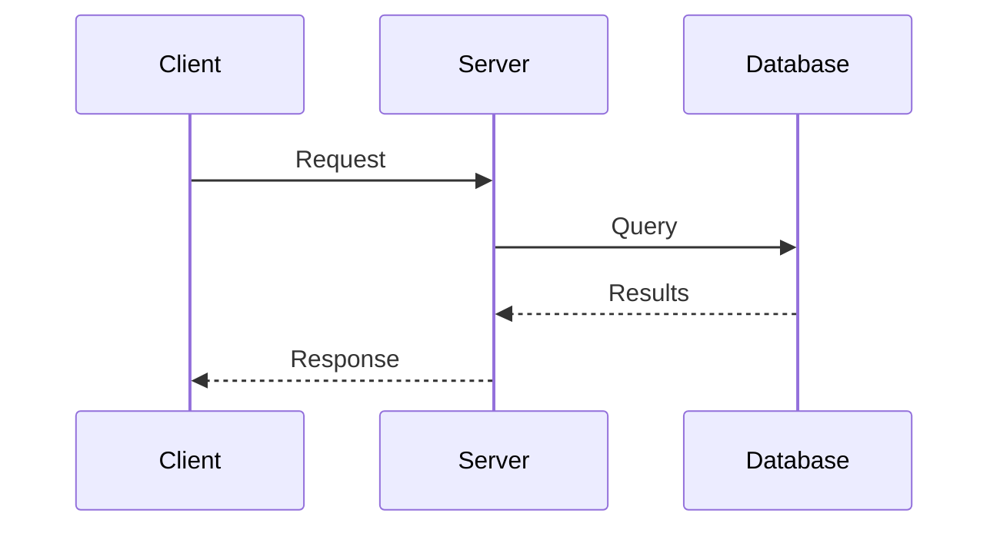
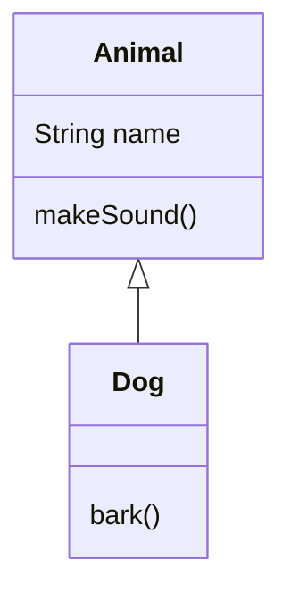
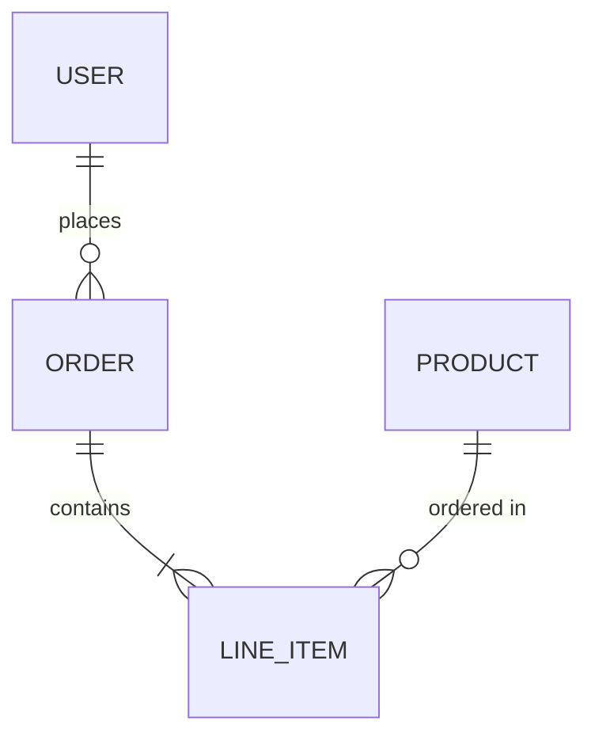
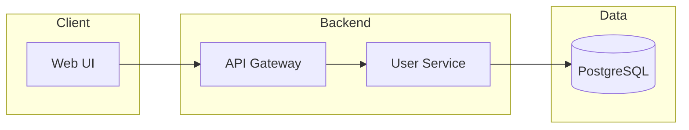

# Diagram Examples

## Flowchart



## Sequence diagram



## Class diagram



## ER diagram



## Architecture with subgraphs



## Text alternative example

For the sequence diagram above:

```
Client --Request--> Server --Query--> Database
Client <--Response-- Server <--Results-- Database
```
